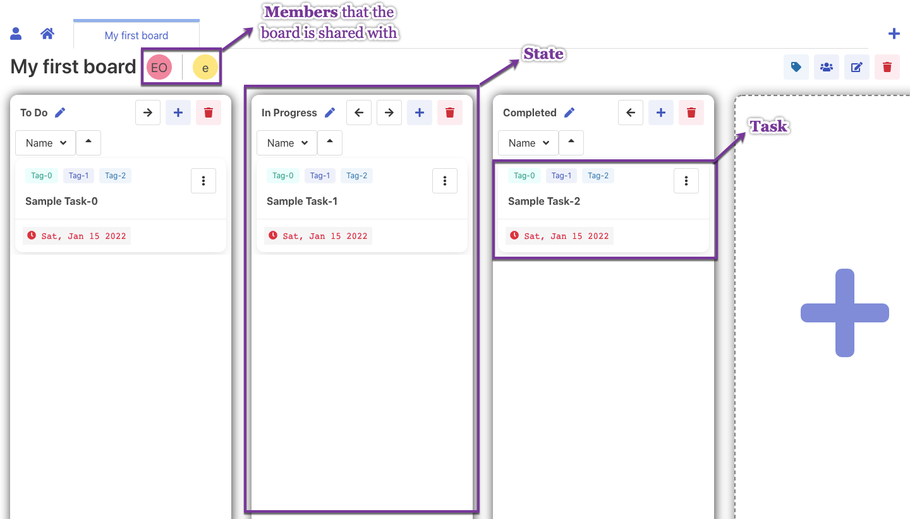

<h1 align="center">Tusk Manager</h1>
<p align="center"></p>
<div align="center">Icons made by <a href="https://www.flaticon.com/authors/smashicons" title="Smashicons">Smashicons</a> from <a href="https://www.flaticon.com/" title="Flaticon">www.flaticon.com</a></div>
<p align="center">Emily Ong Hui Qi (A0240634M)</p>
<p align="center"><a href="https://www.tuskmanager.rocks/">Try it out</a></p>

## Overview

A fully-featured, clutter-free task management application that can run *anytime*, *anywhere*, and enables you to work with *anyone*.

Visit https://www.tuskmanager.rocks/ to try it out.



## Quick Links

This repository serves as a central repository for the following submodules:

- **Documentation** https://github.com/EmilyOng/cvwo-docs
- **Frontend**: https://github.com/EmilyOng/cvwo-frontend
- **Backend**: https://github.com/EmilyOng/cvwo-backend

## Getting Started

### Cloning the repository
Clone the repository. The `recursive` flag is needed due to the use of submodules in this repository.

```shell
git clone --recursive https://github.com/EmilyOng/cvwo.git
```

### Updating submodules
Updating the submodules is required whenever you have made a change in one of the submodule. This ensures that the repository always point to the latest commits. To update the submodules, run:

```shell
./scripts/update-submodules.sh
```

The script might not be executable. In that case, run `chmod +x scripts/update-submodules.sh`. Then, you may execute the above command again.

Then, add, commit and push the changes.
